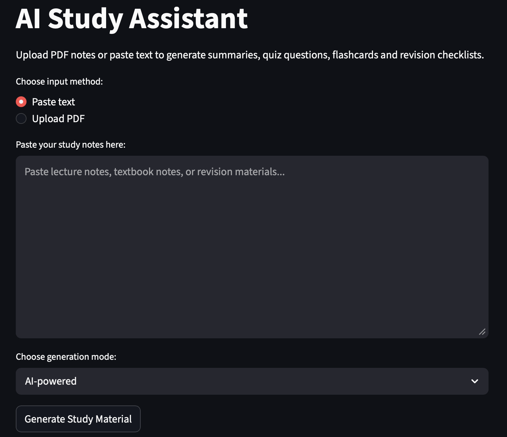
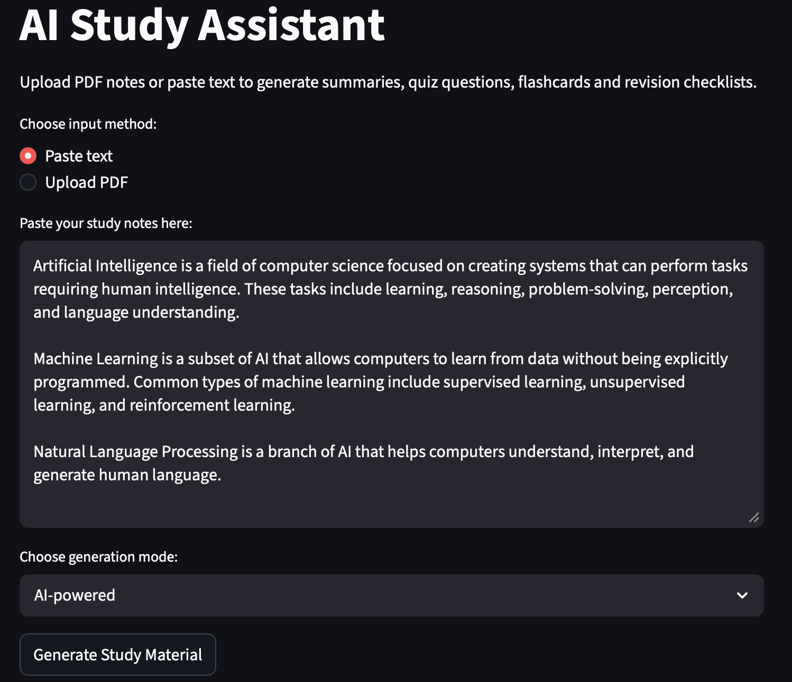
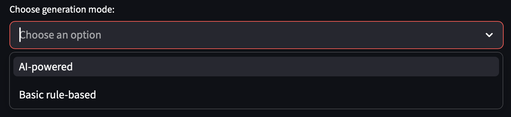

# ai-study-assistant
A Python-based AI Study Assistant that helps students transform lecture notes and PDFs into structured study material - including summaries, key concepts, quiz questions, flashcards and revision checklist.

# Features
1. Paste study notes directly
2. Upload PDF lecture slides or notes
3. AI-powered content generation
4. Generates:
- Summary
- Key Concepts
- Quiz Questions
- Flashcards
- Revision Checklist
5. Download results as Markdown
6. Fallback to rule-based generation (no API needed)

### 1. Empty Input State


### 2. Notes Input Example


### 3. Generation Mode Selection


### Full Demo 🎥
[Watch the demo](Screenshots/full_demo.mp4)

# Tech Stack
- Python
- Streamlit (UI)
- OpenAI API (AI Generation)
- pypdf (PDF text extraction)
- pytest (testing)

# Project Structure
```
ai-study-assistant/
│
├── app/
│   ├── ai_generator.py
│   ├── pdf_reader.py
│   ├── summarizer.py
│   ├── quiz.py
│   ├── flashcard_generator.py
│   └── utils.py
│
├── data/
├── outputs/
├── Screenshots/
├── tests/
│
├── streamlit_app.py
├── README.md
├── requirements.txt
├── .env.example
├── .gitignore
```